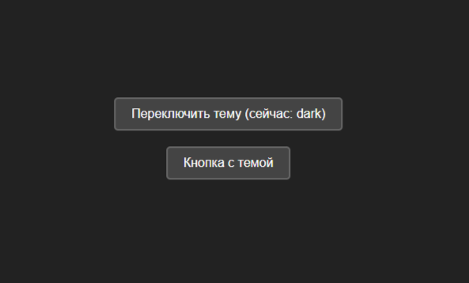
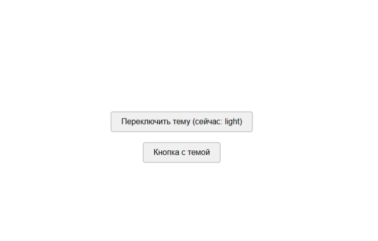

# HOC для управления темой

Учебный проект: реализация компонента высшего порядка (HOC) `withTheme` 
для передачи темы оформления через пропсы

## 📸 Скриншот

## 🛠 Технологии

- **React 18**
- **TypeScript**
- **Vite**